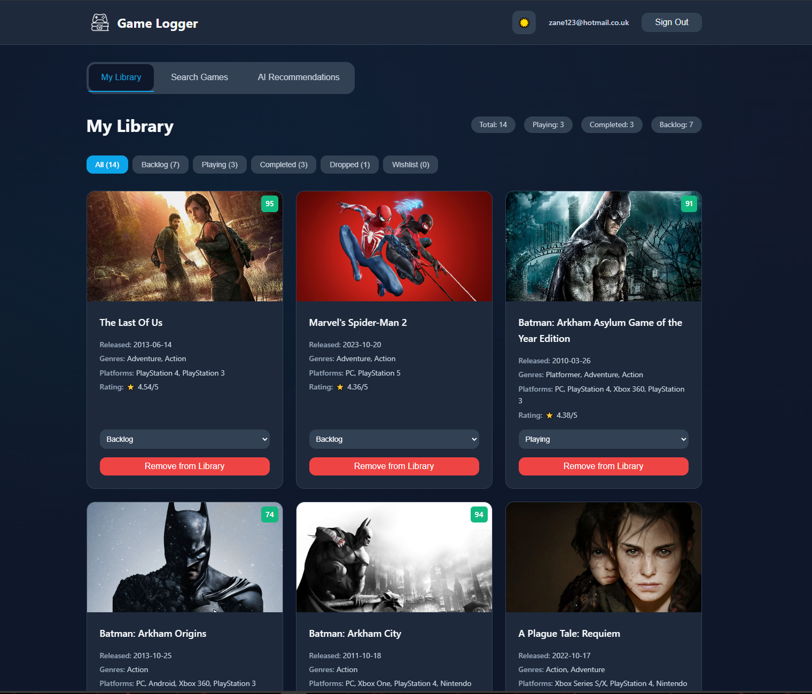
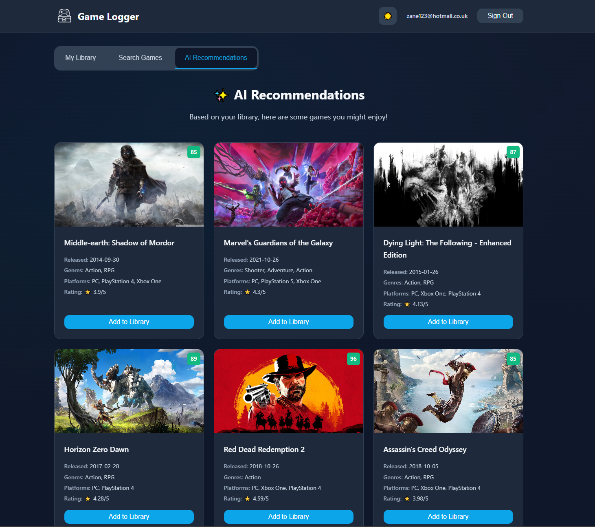

# 🎮 Game Logger

A modern, full-stack web application for tracking your gaming journey. Built with React, Node.js, Express, and Supabase, Game Logger helps you organize your game library, discover new titles, and get AI-powered recommendations.

<p align="center">
  
  
</p>

## ✨ Features

### 🏠 **Personal Game Library**
- Add games to your personal collection
- Track game status (Playing, Completed, Backlog, Dropped, Wishlist)
- View detailed game statistics and progress
- Filter games by status with real-time counters

### 🔍 **Game Search & Discovery**
- Search thousands of games using the RAWG API
- View detailed game information including:
    - Release dates, genres, and platforms
    - Metacritic scores and ratings
    - High-quality screenshots and artwork
    - Developer and publisher information
- Detailed game pages with rich descriptions

### 🤖 **AI-Powered Recommendations**
- Get personalized game recommendations based on your library
- Powered by Google's Gemini AI for intelligent suggestions
- Discover games similar to your favorites
- Avoid duplicates already in your collection

### 🎨 **Modern UI/UX**
- Beautiful dark/light theme toggle
- Responsive design that works on all devices
- Smooth animations and transitions
- Clean, minimalistic interface with professional styling
- Accessible design with proper contrast and semantic markup

### 🔐 **Secure Authentication**
- User registration and login via Supabase Auth
- Secure JWT-based authentication
- Email confirmation for new accounts
- Password reset functionality

## 🛠️ Tech Stack

### Frontend
- **React 18** - Modern React with hooks and functional components
- **React Router** - Client-side routing
- **CSS3** - Custom CSS with CSS variables and modern features
- **Vite** - Fast development and build tool

### Backend
- **Node.js** - Runtime environment
- **Express.js** - Web framework
- **Supabase** - Backend-as-a-Service (Database + Auth)
- **RAWG API** - Game database and information
- **Google Gemini API** - AI-powered recommendations

### Database
- **PostgreSQL** (via Supabase) - Relational database for user data and game library

## 🚀 Getting Started

### Prerequisites
- Node.js (v16 or higher)
- npm or yarn package manager
- Supabase account
- RAWG API key
- Google Gemini API key

### Environment Variables

Create a `.env` file in the server directory:

```env
# Supabase Configuration
SUPABASE_URL=your_supabase_url
SUPABASE_ANON_KEY=your_supabase_anon_key

# API Keys
RAWG_API_KEY=your_rawg_api_key
GEMINI_API_KEY=your_gemini_api_key

# Server Configuration
PORT=3000
```

Create a `.env` file in the client directory:

```env
# Supabase Configuration (Client)
VITE_SUPABASE_URL=your_supabase_url
VITE_SUPABASE_ANON_KEY=your_supabase_anon_key
```

### Database Setup

Create a `games` table in your Supabase database:

```sql
CREATE TABLE games (
    id SERIAL PRIMARY KEY,
    user_id UUID REFERENCES auth.users(id) ON DELETE CASCADE,
    rawg_id INTEGER NOT NULL,
    title VARCHAR(255) NOT NULL,
    cover_url TEXT,
    genres TEXT,
    platforms TEXT,
    release_date DATE,
    metacritic INTEGER,
    rating DECIMAL(3,2),
    status VARCHAR(50) DEFAULT 'backlog',
    created_at TIMESTAMP DEFAULT NOW(),
    updated_at TIMESTAMP DEFAULT NOW()
);

-- Create indexes for better performance
CREATE INDEX idx_games_user_id ON games(user_id);
CREATE INDEX idx_games_rawg_id ON games(rawg_id);
CREATE INDEX idx_games_status ON games(status);

-- Enable Row Level Security
ALTER TABLE games ENABLE ROW LEVEL SECURITY;

-- Create policy to allow users to only access their own games
CREATE POLICY "Users can only see their own games" ON games
    FOR ALL USING (auth.uid() = user_id);
```

### Installation

1. **Clone the repository**
   ```bash
   git clone https://github.com/yourusername/game-logger.git
   cd game-logger
   ```

2. **Install server dependencies**
   ```bash
   cd server
   npm install
   ```

3. **Install client dependencies**
   ```bash
   cd ../client
   npm install
   ```

4. **Start the development servers**

   Terminal 1 (Server):
   ```bash
   cd server
   npm run dev
   ```

   Terminal 2 (Client):
   ```bash
   cd client
   npm run dev
   ```

5. **Open your browser**
   Navigate to `http://localhost:5173` to view the application.

## 🎯 API Endpoints

### Authentication Routes
- `GET /api/supabase` - Get user's games or stats
- `POST /api/supabase` - Add game to library
- `PUT /api/supabase` - Update game status
- `DELETE /api/supabase` - Remove game from library

### Game Data Routes
- `GET /api/rawg?type=search&search={query}` - Search games
- `GET /api/rawg?type=details&id={id}` - Get game details
- `GET /api/rawg?type=screenshots&id={id}` - Get game screenshots
- `GET /api/rawg?type=genres` - Get all genres
- `GET /api/rawg?type=platforms` - Get all platforms

### AI Recommendations
- `POST /api/game-recommender` - Get AI-powered game recommendations

## 🎨 Theming

Game Logger supports both light and dark themes with a beautiful, modern design:

- **Dark Theme**: Professional dark blue palette with subtle gradients
- **Light Theme**: Clean white background with soft grays
- **CSS Variables**: Easy customization of colors, spacing, and typography
- **Smooth Transitions**: Animated theme switching

## 🔧 Key Features Implementation

### Game Status Management
Games can be organized into different categories:
- **Playing** - Currently active games
- **Completed** - Finished games
- **Backlog** - Games to play later
- **Dropped** - Abandoned games
- **Wishlist** - Games you want to buy

### AI Recommendations Engine
The recommendation system:
1. Analyzes your game library
2. Sends game titles to Google Gemini AI
3. Receives intelligent recommendations
4. Fetches detailed game data from RAWG API
5. Filters out games already in your library
6. Presents personalized suggestions

### Responsive Design
- Mobile-first approach
- Flexible grid layouts
- Touch-friendly interfaces
- Optimized for tablets and phones

## 🤝 Contributing

1. Fork the repository
2. Create a feature branch (`git checkout -b feature/amazing-feature`)
3. Commit your changes (`git commit -m 'Add amazing feature'`)
4. Push to the branch (`git push origin feature/amazing-feature`)
5. Open a Pull Request

## 📝 License

This project is licensed under the MIT License - see the [LICENSE](LICENSE) file for details.

## 🙏 Acknowledgments

- [RAWG API](https://rawg.io/apidocs) for comprehensive game database
- [Supabase](https://supabase.com/) for backend infrastructure
- [Google Gemini](https://ai.google.dev/) for AI-powered recommendations

## 📞 Support

If you have any questions or need help getting started, please open an issue.

---

**Happy Gaming! 🎮**